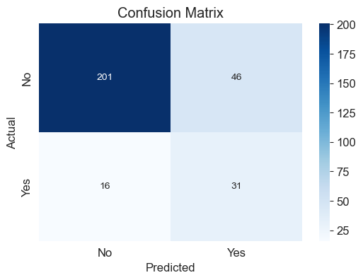
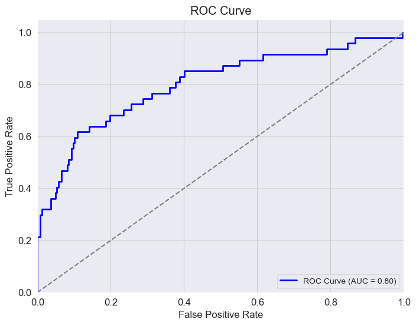

# Employee Attrition Analysis and Prediction

## 📌 Project Overview

This project focuses on analyzing employee attrition using HR data to identify key factors influencing employee turnover. By preprocessing and engineering the data, addressing class imbalance, and applying machine learning algorithms, the goal is to build a predictive model capable of accurately forecasting employee attrition.

## 📦 Environment Setup

To ensure reproducibility, the project dependencies are listed in both `requirements.txt` and `environment.yaml` dependency files.

### **Using Conda (`environment.yaml`)**

If you are using **Conda**, create the environment with:

```bash
conda env create -f environment.yaml
```

Activate the environment:

```bash
conda activate ds_env
```

### **Using pip (`requirements.txt`)**

If you prefer **pip**, install dependencies using:

```bash
pip install -r requirements.txt
```

---

## 📄 Dataset (**[Kaggle Link](https://www.kaggle.com/datasets/pavansubhasht/ibm-hr-analytics-attrition-dataset)**)

The dataset used for this project contains employee information such as job role, satisfaction levels, work-life balance, salary, and attrition status, among other factors. The target variable is **Attrition**, indicating whether the employee left the company (1) or stayed (0).

## ⚒️ Data Preprocessing

The dataset was preprocessed through several steps:

- **Encoding categorical variables** using `OneHotEncoder` and `OrdinalEncoder`.
- **Feature scaling** using `StandardScaler` for numerical features to normalize the data.
- **Feature engineering** to create new features and enhance the dataset.
- **Feature selection** using `SelectKBest` with `f_classif`.

## ⚙️ Model Training

Multiple classification models were trained on the dataset, including **_Logistic Regression, SVM, Random Forest_**, and others. After evaluating the models, **Logistic Regression** model with the `class_weights` parameter was selected as the best-performing model for predicting employee attrition. Despite addressing the class imbalance with `class_weights`, the model still favors predicting **non-attrition (0)**, which is expected given the highly imbalanced nature of the dataset.

### 📈 Performance Evaluation

The model's performance was evaluated using the following metrics:

- **Confusion Matrix**: The confusion matrix highlights the model's difficulty in correctly predicting cases of employee attrition due to class imbalance.
  

- **ROC Curve**: _The Area Under the Curve_ (**AUC**) score is **0.80**, indicating a good level of discrimination between the two classes.
  
